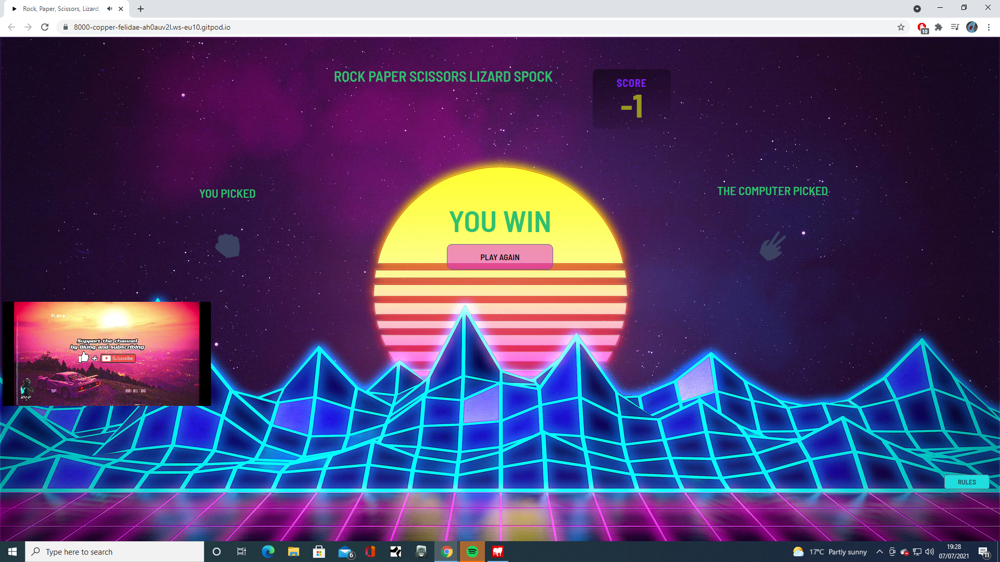
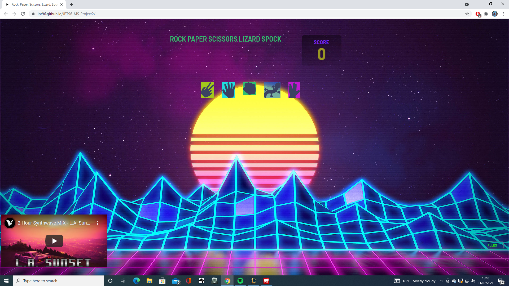

# JPT96-MS-Project2

## About

for my second MileStone project I wanted to do something simple, that would also allow me to apply the lessons I have learnt in my javascript module.
So I created a rock paper scissors lizard spock game.

## Table of Content
* [ UX & UI](#my-ux-choices-and-my-ui-choices)
* [Features](#features)
* [Future Features](#future-features)
* [Tech Used](#technologies-used)
* [Testing](#testing)
* [Deployment](#deployment)
### UX justification.
the user experience is somewhat simple in design, it's a simple selection with five buttons to choose from. Based on a twist of a classic game. 
as the score goes up or below zero depending on wether the random selector is winning or the user who is playing is winning. 
One negative view of this game is that there is no win condition, I haven't built in a win condition as winning isn't the main priorty of the game.
It has simply been created to demonstrate my progress with javascript.
### UI Justification.
the User interface is very simple with a hover on cursor so you know what you are picking. as well as the linear fade on the rules so you know that you are hovering that as well as the play again button. It was challenging to make it seem fun as well as intuitve.
I have added a animation to liven things up a little as well. 
## Features.
the features within this application are also limited. 
There is a score board, a variety of coices to pick from and a play again button as well as a rules button in the bottom right corner.
With the score board I did try two scores. But I didn't like the layout and it made the title feel very cramped. So I decided to just keep the single box.

## design
* color scheme
with the colour scheme it is a very basic pallete, here are the recipes below;
for the writting in the title and normal text:#2fbf6f;
for the score title: #608ed4,hsl(229, 64%, 46%);

* imagery
for the images I have used the free rescource for these images (given credit to frontend mentor) all have been edited in light room to adjust for the size.
i didn't want anything flashy for this so I went with silouhette shapes for each selection. 

### Future Features
If I had more time for this project I would like to make the buttons a lot more flashy and appealing and try and flip the style I have created on it's head.
Going from a dark page that doesn't have much going on to something that is bright and colourful.
I would like to create a username option, even a fun prompt in the Javascript when a score limit is reached that would send you to potentially a flash games website.

## Technologies used
If you wish to look at the technologies used within my project you can find them listed below.
[light room] <https://en.wikipedia.org/wiki/Adobe_Lightroom>
 
[html 5]<https://en.wikipedia.org/wiki/HTML5>
 
[CSS3] <https://en.wikipedia.org/wiki/CSS>
 
[JavaScript] <https://en.wikipedia.org/wiki/JavaScript>
 
[gitpod] <https://www.gitpod.io/>
 
[github] <https://github.com/>
 
## Testing
When testing this out it was hard to get the score counter to work, this comes from me slowly learning Javascript. I would like to say that I am still learning javascript and actually find myself needing to refresh constantly, especially when it comes to things like DOM and functions. So this naturally lead to a gurelling testing stage of trying to make them work. All of my commits are when something has been achieved so unfortunatley I didn't have this process commited which in hindsight is problem.
Getting the buttons to stay central proved challenging as they would like to sit at weird angles on different sized screens so I simply removed the width at 100% and let them sit as a collum in the centre which I find is a pleasing placement.
All of my issues usually came from Javascript but once again this is absolutely a step up from HTML and CSS, and with that came many teething issues and problem solving skills really being tested.

 ## bugs
 There a no known bugs.
 
 ## credit & acknowledgement
 I would like to give credit to the many many tutorials and forums that have made similiar games. And have insipred some of the layouts throughout the game.
giving direct quotes to some here are those hyperlinks;
[webdevSimplified] <https://www.youtube.com/watch?v=1yS-JV4fWqY&ab_channel=WebDevSimplified>
 
[freeCodeCamp.org]<https://www.youtube.com/watch?v=jaVNP3nIAv0&ab_channel=freeCodeCamp.org>
 
[frontend Mentor(florin pop)]<https://www.youtube.com/watch?v=HcppIYQLTxY&ab_channel=FlorinPop>
 
 
 ## Deployment 
 ### publishing
 1. Go to the GitHub website and log in.
 2. On the left-hand side, you'll see all your repositories, select the appropriate one. (Repository used for this project).
 3. Under the name of your chosen Repository you will see a ribbon of selections, click on 'Settings' located on the right hand side.
 4. Scroll down till you see 'GitHub Pages' heading. 
 5. Under the 'Source' click on the dropdown and select 'master branch' 
 6. The page will reload and you'll see the link of your published page displayed under 'GitHub' pages. 
 7. It takes a few minutes for the site to be published, wait until the background of your link changes to a green color before trying to open it.
 
